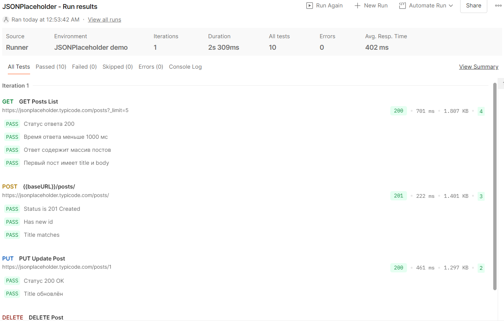
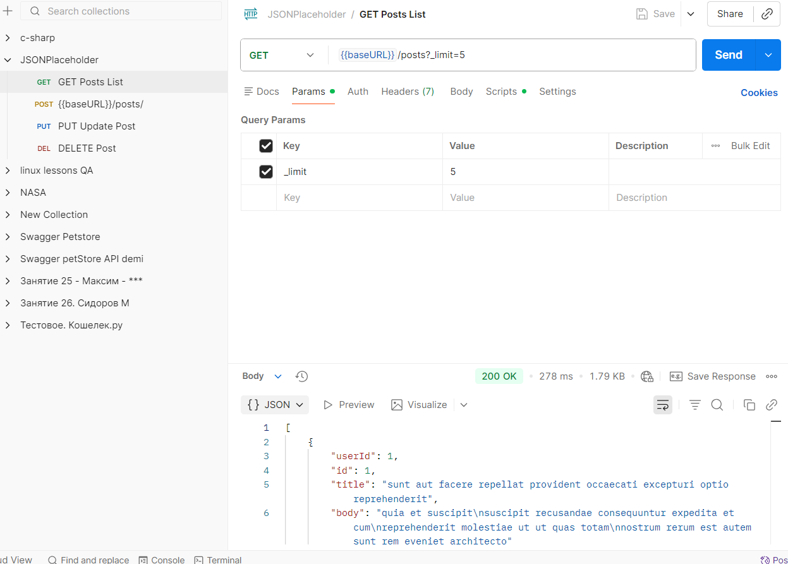
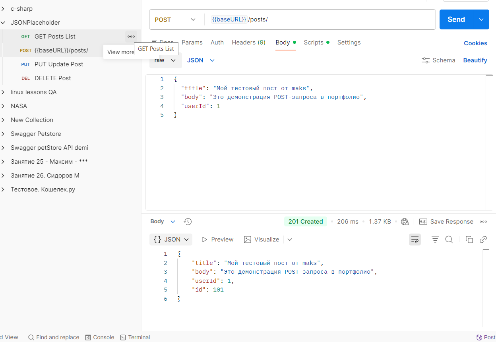
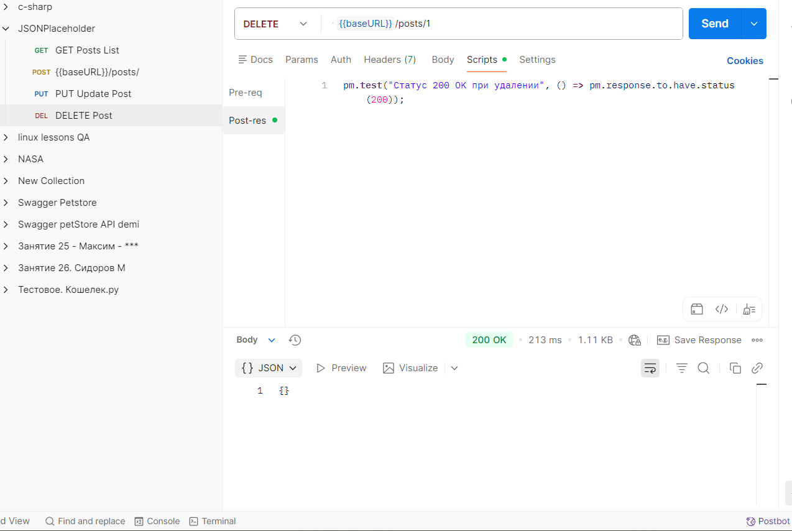

# Postman — API Testing Examples

Коллекции и тесты REST API в Postman.  
Использую для ручного и полуавтоматического тестирования.

## Коллекция: JSONPlaceholder Demo

- GET /posts — список постов (с лимитом)  
- POST /posts — создание поста  
- PUT /posts/1 — обновление поста  
- DELETE /posts/1 — удаление поста

Тесты в коллекции проверяют:
- Статус-коды (200, 201, 204 и т.д.)
- Время ответа (< 1000 мс)
- Наличие обязательных полей в JSON
- Соответствие заголовка/тела (при PUT)

[Скачать коллекцию → JSONPlaceholder.final.postman_collection.json](JSONPlaceholder.final.postman_collection.json)

## Как запустить

1. Скачай .json-файл коллекции (кликни → Download)
2. Postman → Import → выбери файл
3. Запусти коллекцию через Runner → Run all requests

## Скриншоты 

## Runner с результатами тестов

## GET Posts List  
  

## POST Create Post  
  

## PUT Update Post  
  

## DELETE Post  
  

