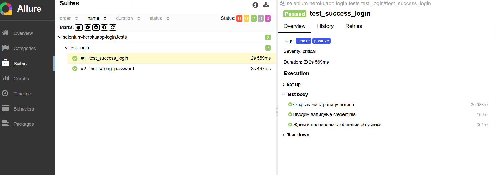
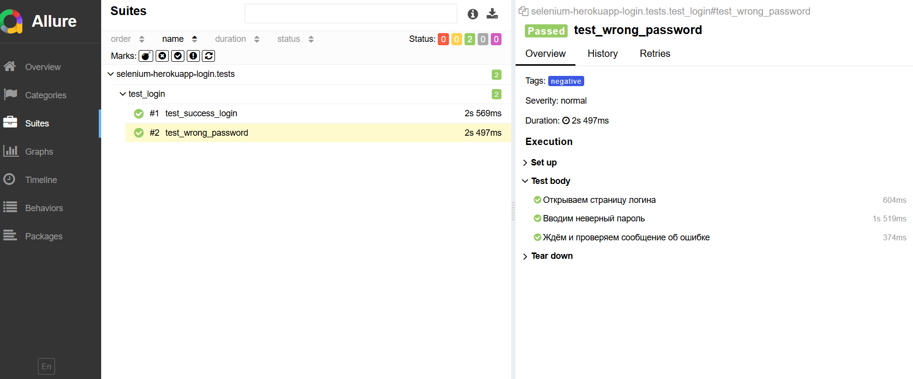

# Selenium + Pytest + Allure  
## UI Automation — Login Test (Herokuapp Demo)

Небольшой проект автоматизации UI-тестирования страницы логина  
https://the-internet.herokuapp.com/login

**Используемый стек:**
- Python
- Selenium WebDriver
- Pytest
- Allure Report

---

## Покрытые сценарии

### ✅ 1. Успешная авторизация
- Открытие страницы
- Ввод валидных credentials
- Проверка сообщения об успешном входе

### ❌ 2. Неверный пароль
- Открытие страницы
- Ввод некорректного пароля
- Проверка сообщения об ошибке

---

## Используемые инструменты

- @pytest.fixture для управления браузером
- Явные ожидания (WebDriverWait)
- Allure:
  - epic / feature / story
  - severity
  - tags
  - шаги выполнения теста

---

## Как запустить проект

1. Установить зависимости
   ```bash
   pip install -r requiremets.txt
2. Запустить тесты
   ```bash
   pytest
3. Сформировать Allure отчет
   ```bash
   pytest –alluredir=allure-results
   allure serve allure-results

## 📊 Allure Report

Проект использует Allure для визуализации результатов тестирования.


### Позитивный сценарий


### Негативный сценарий


