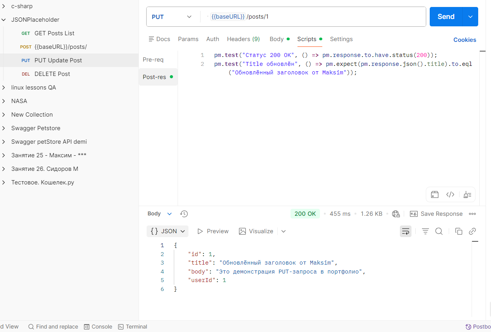

# Postman — API Testing Demo (JSONPlaceholder)

**Практика тестирования REST API на открытом мок-API JSONPlaceholder.typicode.com** 

**Коллекция содержит** 
- GET /posts — список постов  
- POST /posts — создание поста  

**Тесты** 
- Статус-код 200/201  
- Время ответа  
- Структура ответа

**Добавлено 02.02.2026**   
- PUT /posts/{id} — обновление поста  
- DELETE /posts/{id} — удаление поста  
- Тесты на статус-коды и значения в ответе

### Swagger Petstore (импорт из OpenAPI)
- Коллекция создана из официального Swagger Petstore  
- GET /pet/findByStatus — поиск питомцев  
- POST /pet — создание питомца  
- GET /pet/{petId} — получение одного питомца  
- Тесты на статус, время ответа, структуру JSON

**Как запустить**   
1. Импортировать .json файлы в Postman  
2. Выбрать окружение  
3. Запустить запросы

## Скриншоты работы с Postman

***GET запрос + зелёные тесты*** 
  

***POST создание поста + тесты*** 
  

***PUT обновление поста***
  

***DELETE запрос + статус 200*** 
  

## Результаты прогона коллекции (Collection Runner)
***Все запросы прошли успешно, тесты зелёные*** 
  

Last updated: February 2026
