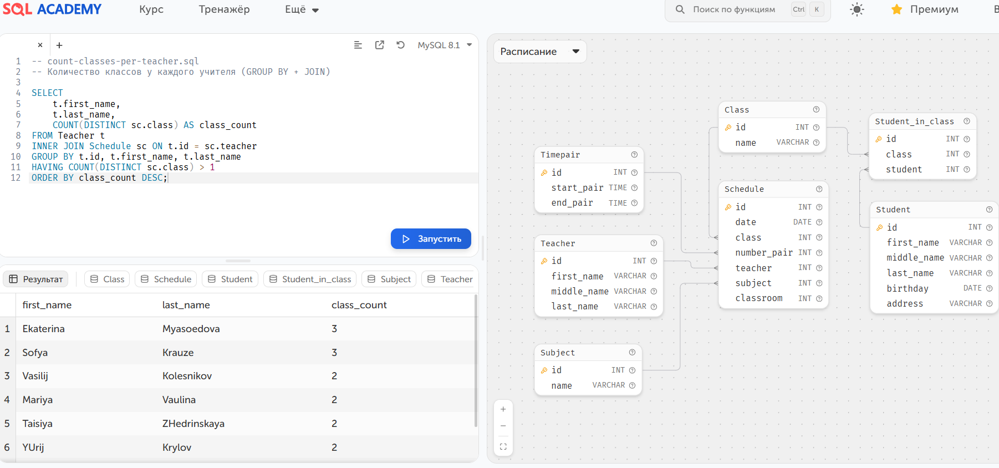
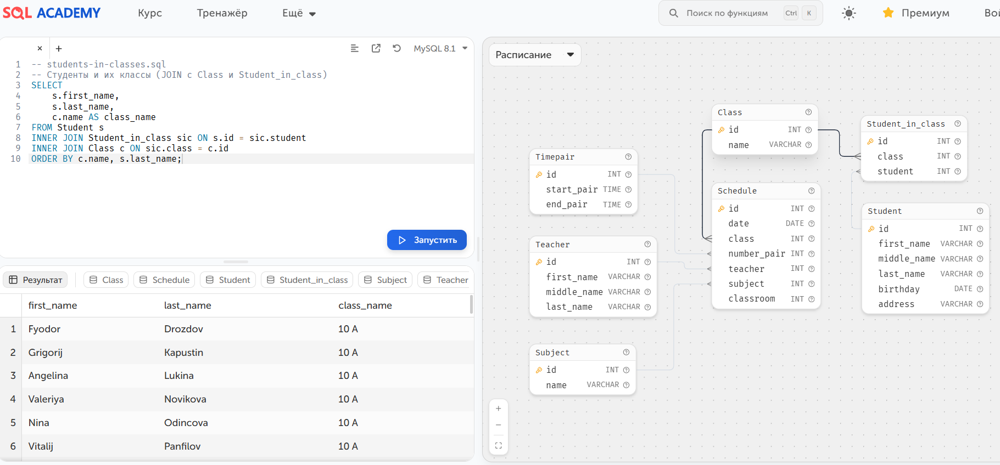
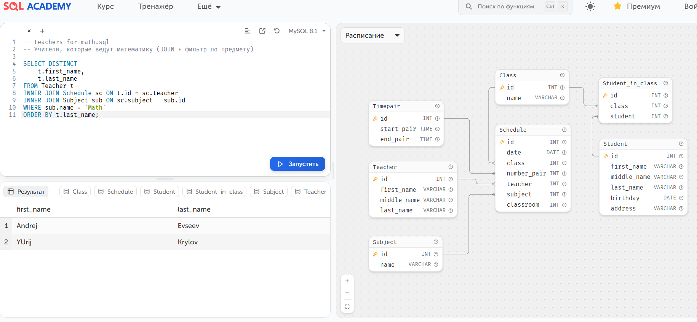

# SQL Examples for QA

Примеры запросов на учебной базе SQL Academy (https://sql-academy.org/).  

## Список запросов

## 1.  [count-classes-per-teacher.sql](count-classes-per-teacher.sql)  
   ### Количество классов у каждого учителя (GROUP BY + JOIN + HAVING)
     

## 2.  [select-all-students.sql](select-all-students.sql)  
   ### Все студенты с сортировкой по фамилии (SELECT + ORDER BY)  

## 3.  [teachers-for-math.sql](teachers-for-math.sql)  
   ### Учителя, которые ведут математику (JOIN + фильтр по предмету)  

Все запросы протестированы и дают корректные результаты.
