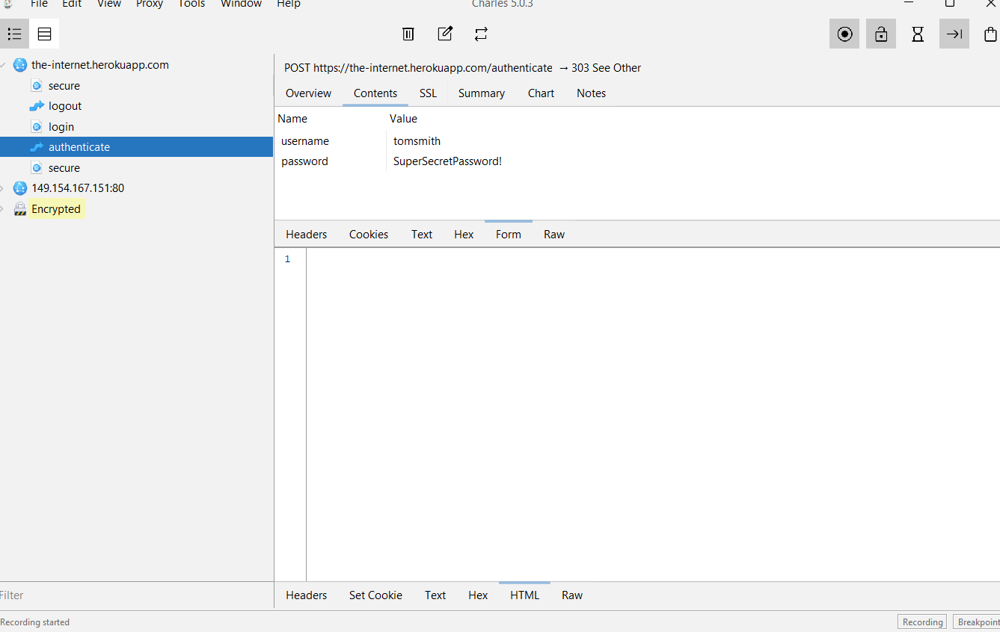
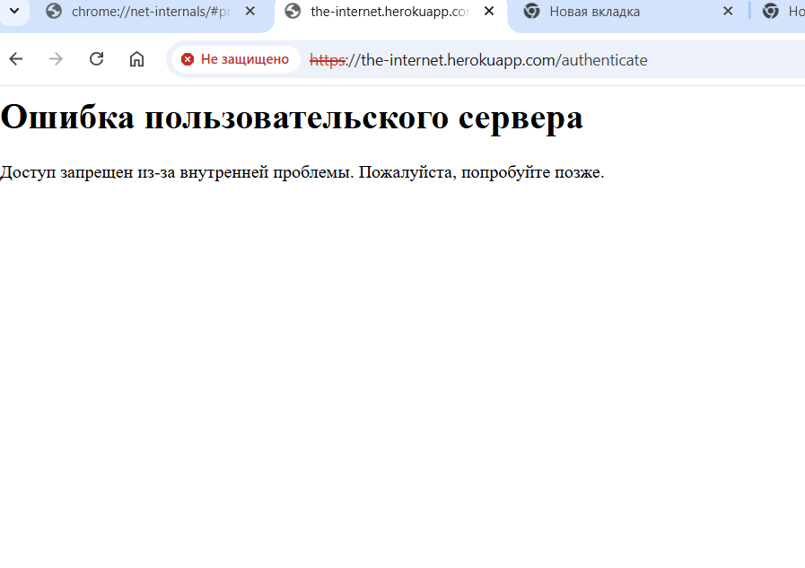
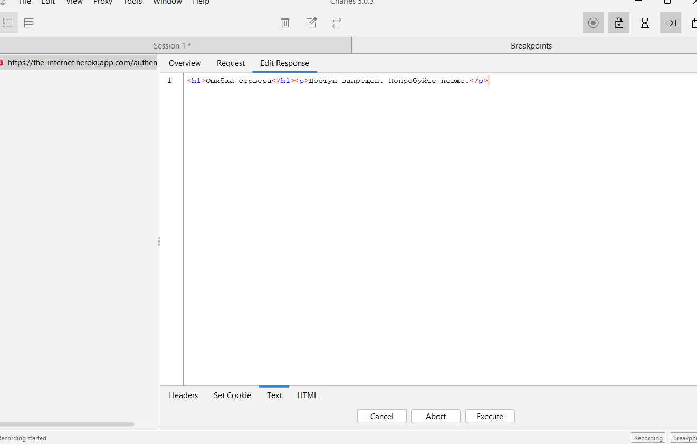
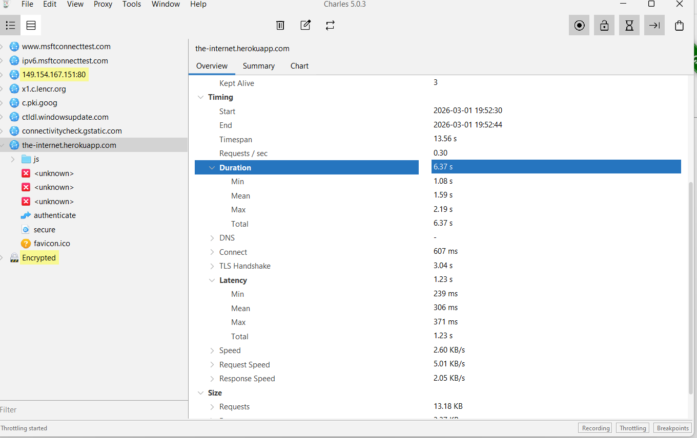
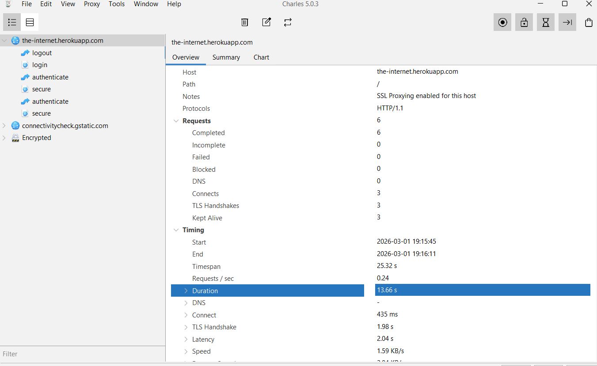

# Charles Proxy Examples

Использовал Charles для перехвата трафика, mock и throttling на сайте https://the-internet.herokuapp.com/login.

## 1. Перехват трафика (Intercept)
- POST /authenticate с log/pass.  
- Body: username=tomsmith, password=SuperSecretPassword!  
- Статус: 303 See Other.  
Скрин: 
    

## 2. Mock ответа 
- Изменил статус на 500, body на "Error".  
- Браузер показал подменённую ошибку.  
Скрин: 
  
    

## 3. Throttling 
- Настроил 3G, загрузка стала 5+ сек.  
Скрин: 
 
 
Заключение: Полезно для API-тестов и симуляции проблем.
