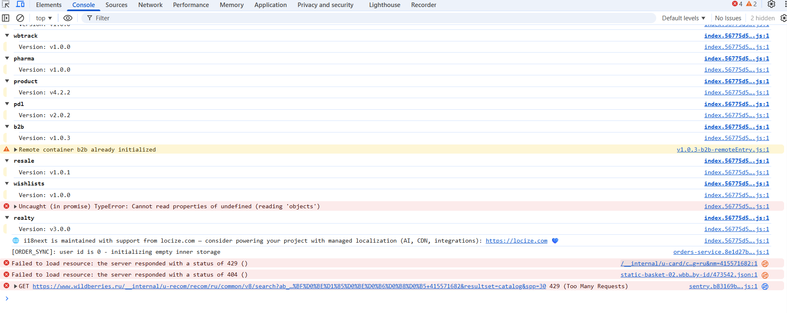
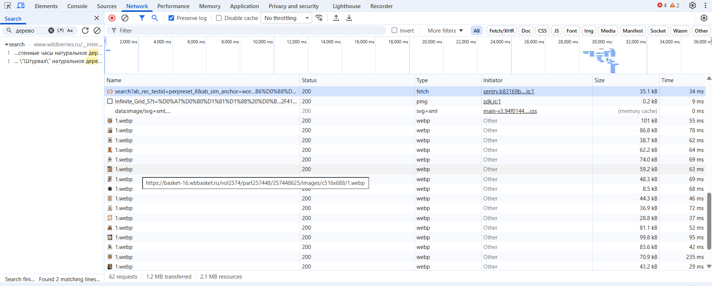

# DevTools (Chrome / Firefox)

Примеры использования DevTools для анализа UI, поиска локаторов, отладки запросов и багов.

## Примеры

### 1. Console — анализ ошибок и логов (Wildberries поиск)

Что видно:
- Ошибка 429 Too Many Requests (rate limit API)  
- TypeError: Cannot read properties of undefined  
- Много логов от сторонних библиотек (whtrack, pharm, pd1 и т.д.)  
- Это помогает быстро находить JS-ошибки, которые не видны пользователю

### 2. Network — анализ запросов поиска (Wildberries)

Что видно:
- Фильтр Fetch/XHR — только API-запросы  
- Главный запрос поиска (search) со статусом 200  
- Время ответа, параметры запроса (limit, query)  
- Waterfall — показывает, сколько грузился каждый ресурс  
- Это используется для проверки API-ответов, времени загрузки и поиска багов в сетевых запросах
